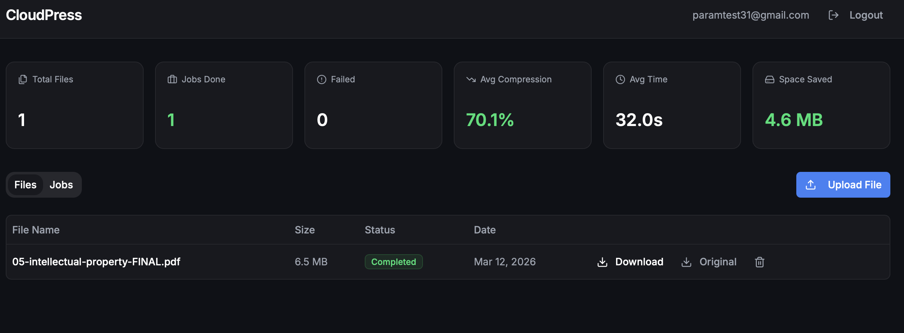

# CloudPress

A cloud file compression service. Upload files, compress them asynchronously, download the result.



---

## Stack

| | |
|---|---|
| Backend | Java 21 + Spring Boot 3.2 |
| Frontend | React + TypeScript + Vite |
| Database | PostgreSQL + Flyway |
| Storage | AWS S3 (LocalStack for local dev) |
| Auth | JWT |
| Packaging | Docker multi-stage build |

---

## How it works

1. Client requests a presigned S3 URL from the API
2. File is uploaded directly to S3 (bypasses the API server)
3. A compression job is queued and processed asynchronously
4. Compressed output is saved back to S3
5. Client downloads via a presigned download URL

**Compression formats:**
- **PDF** → Ghostscript optimizer (~40–70% reduction)
- **Images (PNG/JPEG)** → JPEG re-encode at 50% quality
- **Other files** → GZIP or ZIP (level 9)

Failed jobs retry up to 3 times with exponential backoff.

---

## Running locally

**Requirements:** Docker + Docker Compose

```bash
docker compose up --build
```

- App: `http://localhost:8080`
- Frontend: served by the app on the same port
- PostgreSQL: `localhost:5432`
- LocalStack (S3): `localhost:4566`

---

## API

| Method | Path | Description |
|---|---|---|
| `POST` | `/api/v1/auth/register` | Register |
| `POST` | `/api/v1/auth/login` | Login, get JWT |
| `POST` | `/api/v1/files` | Create file + get presigned upload URL |
| `POST` | `/api/v1/files/:id/confirm-upload` | Confirm upload complete |
| `GET` | `/api/v1/files/:id/download` | Get presigned download URL |
| `POST` | `/api/v1/jobs` | Submit compression job |
| `GET` | `/api/v1/jobs` | List jobs |
| `GET` | `/api/v1/stats` | Aggregated stats |
